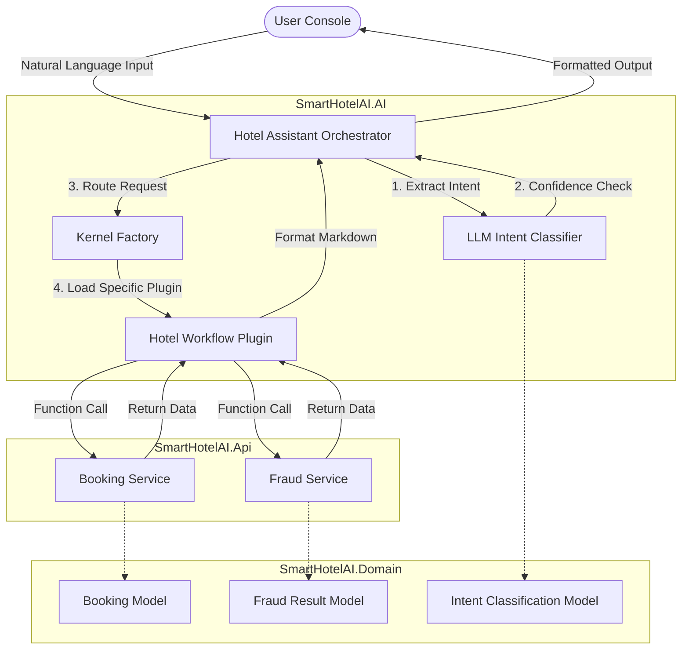

# SmartHotelAI - Architecture Documentation

## 1. Project Overview
SmartHotelAI is a console-based hotel management system built following the **OpenClaw Architecture Pattern**, enhanced with advanced AI capabilities using **Microsoft Semantic Kernel**. The project serves as a practical showcase for enterprise-grade AI integration, focusing on natural language intent classification, programmatic routing, and intelligent fraud detection while significantly reducing LLM token usage.

## 2. The OpenClaw Architecture Pattern

SmartHotelAI implements the **OpenClaw Project Pattern**. This pattern is designed to solve the issues of high latency, high cost, and unpredictability common in typical conversational AI systems. 

**Core Concept:** Separate *Understanding* from *Execution*. Instead of relying on an LLM to figure out tool selection and orchestration on the fly, OpenClaw mandates that the LLM is only used as an **Intent Classifier and Parameter Extractor**. The actual routing and execution happen deterministically in native code.

### How it is implemented in SmartHotelAI:
1. **Understanding Layer**: When a user inputs "book a room for 3 nights", the system calls the LLM just once. The LLM returns a structured object: `{ Intent: "BookRoom", Nights: 3 }`.
2. **Execution Layer**: The `HotelAssistantOrchestrator` receives the object and uses programmatic routing to pass the data directly to the `BookingService` without needing any further LLM intervention.

### High-Level Flow Diagram

## 3. Core Modules & Components

The solution is divided into four cleanly separated projects following a domain-driven design approach:

### 3.1 Domain Layer (`SmartHotelAI.Domain`)
Contains the core business entities and strongly-typed objects. No dependencies on other layers.
* **`Booking.cs`**: Core entity representing a hotel reservation.
* **`FraudResult.cs`**: Contains fraud risk levels and reasons.
* **`UserIntent.cs`**: Enum defining valid operations (BookRoom, CancelBooking, CheckFraud, GetHistory).
* **`IntentClassificationResult.cs`**: The structured output from the LLM classifier.

### 3.2 API Layer (`SmartHotelAI.Api`)
Handles the core business logic. This layer remains purely programmatic and unaware of any AI context.
* **`BookingService.cs`**: Manages the lifecycle of bookings (Book, Cancel, GetAll, GetById).
* **`FraudService.cs`**: Evaluates bookings against specific business rules to detect suspicious behavior (e.g., booking frequency, monetary thresholds, blacklists).

### 3.3 AI Layer (`SmartHotelAI.AI`)
The core intelligence layer leveraging Microsoft Semantic Kernel. 
* **Intent-First Design**: Uses an LLM to accurately determine user intent (`IntentClassifier.cs`) and extract required entities.
* **Semantic Kernel Plugins**: The `HotelWorkflowPlugin.cs` exposes API services to the orchestration layer via `[KernelFunction]` attributes.
* **Programmatic Routing**: Once the intent is identified, the `HotelAssistantOrchestrator.cs` invokes the necessary plugin functions directly, avoiding LLM-hallucinated function calls and significantly reducing token usage.
* **Token Optimization**: Includes a `TokenUsageTracker.cs` to measure efficiency.

### 3.4 Console / Client Layer (`SmartHotelAI.Console`)
The entry point of the application. It bootstraps the Semantic Kernel, injects dependencies, and provides the interactive terminal UI for the user.

## 4. Key Workflows & Features

### 4.1 Natural Language Booking
Users can book a room using unstructured text. The system extracts the intent and entities (e.g., guest name, room type, nights) to process the booking.

**Example: Initiating a Booking**

**Example: Booking Confirmation**

### 4.2 AI-Powered Fraud Detection (Highlight)
A specialized feature that analyzes booking patterns. If a user asks to check a booking for fraud, the system evaluates:
1. Short-term frequency (e.g., >3 bookings in 5 minutes)
2. High-value thresholds (e.g., >$5000)
3. Rapid cancel-rebook patterns

**Example: Fraud Alert Triggered**

### 4.3 Booking Cancellation & History Retrieval
Users can cancel their bookings or retrieve past histories intuitively.

**Example: Booking Cancellation**

**Example: Booking History**

## 5. Token Optimization Strategy
SmartHotelAI implements a highly optimized architecture to minimize LLM inference costs:

### Enterprise Approach (~175 tokens)
- **Intent Classification**: 175 tokens (System prompt + Input + Output)
- **Execution Phase**: 0 tokens (Programmatic routing, no LLM involved)

### Original Approach (~1000+ tokens)
- **Intent Classification**: 331 tokens
- **Execution Phase**: 434+ tokens (Tool selection LLM call + response formatting)
- **Hidden costs**: ~200+ tokens uncounted

**Result: 82.5% Token Reduction** (825 tokens saved per request). By avoiding conversational LLM agents for tool execution and instead utilizing programmatic routing, the token overhead drops from an estimated 1000+ tokens to just ~175 tokens per interaction.
