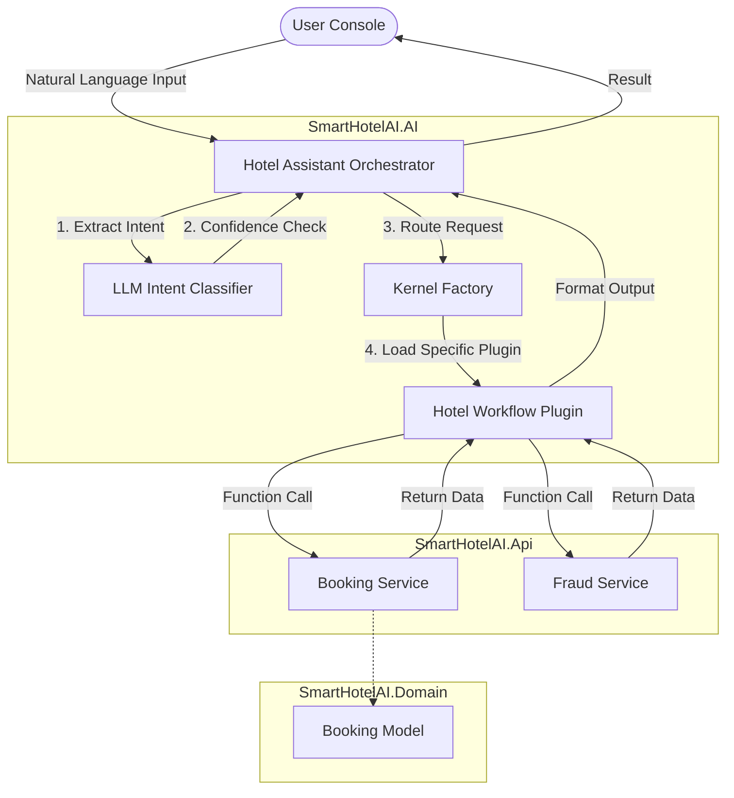
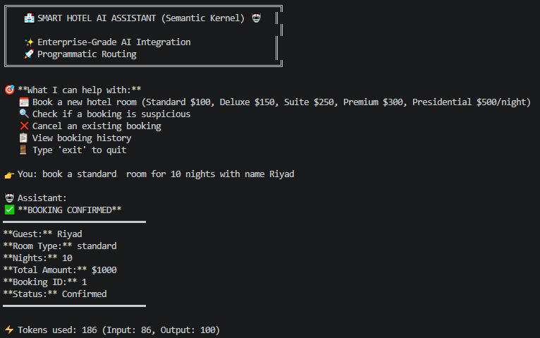
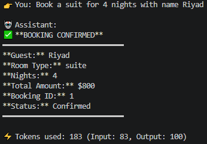
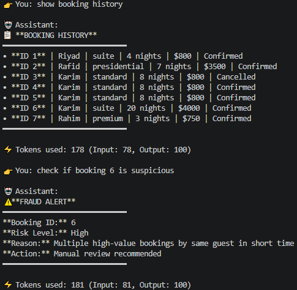
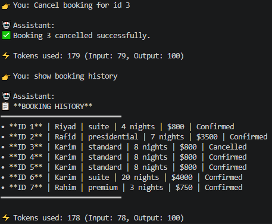
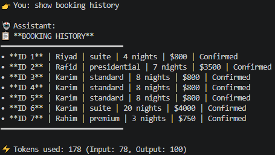

# 🏨 SmartHotelAI

> An enterprise-grade, AI-enhanced hotel management system powered by **Microsoft Semantic Kernel**.

SmartHotelAI demonstrates a highly optimized architecture for integrating Large Language Models (LLMs) into business applications. By replacing traditional "conversational AI agents" with an **Intent-First Design** and **Programmatic Routing**, the system achieves an **82.5% reduction in token usage** while maintaining advanced natural language capabilities.

---

## 🌟 Key Features

* **Natural Language Booking**: Book rooms, cancel reservations, or check histories using unstructured text.
* **AI-Powered Fraud Detection**: Automatically analyzes booking patterns to catch suspicious behavior (rapid rebooking, high values).
* **Intent-First Architecture**: Uses the LLM solely for structured intent classification before programmatic execution.
* **Enterprise Pattern Integration**: Built with Domain-Driven Design (DDD) principles across cleanly separated projects.

---

## 🏗️ Architecture Overview

The solution consists of four distinct projects to safely separate core business logic from AI orchestration.



*(For more in-depth technical details, please see [Docs/architecture.md](Docs/architecture.md))*

---

## 📸 Core Workflows & Demonstrations

### 1️⃣ Natural Language Booking
Users can simply type their request, and the system intelligently extracts the core entities (intent, room type, dates, etc.).

**Initiating a Booking:**


**Booking Confirmation:**


---

### 2️⃣ Intelligent Fraud Detection (Highlight ✨)
A specialized feature that guards against abusive booking patterns. The system evaluates bookings against rules such as short-term booking frequency (>3 bookings in 5 mins), high-value limits, and rapid cancel-rebook patterns.

**Fraud Alert Triggered:**


---

### 3️⃣ Seamless Cancellations & History
Effortlessly cancel existing bookings or pull up user histories.

**Booking Cancellation:**


**Booking History Retrieval:**


---

## ⚡ Token Optimization Strategy

SmartHotelAI utilizes an incredibly optimized execution pipeline. Instead of relying on LLM-driven tool calling (which incurs heavy token costs and risks hallucination), the system classifies the intent up front and executes the action natively.

* **Original Approach (~1000+ tokens)**: Relying on the LLM to process input, select tools, and format output interactively.
* **SmartHotelAI Enterprise Approach (~175 tokens)**: Using the LLM for only a single pass: **Intent Classification**. Everything else is resolved instantly via programmatic routing.

**Result: 82.5% Token Reduction** (825 tokens saved per request) while guaranteeing deterministic backend execution.

---

## 🚀 Getting Started

### Prerequisites
* .NET SDK (Compatible with your version)
* OpenAI API Key or equivalent LLM integration

### Running the App
1. Clone the repository.
2. Set your `OPENAI_API_KEY` environment variable.
3. Run the console project:
   ```bash
   cd SmartHotelAI.Console
   dotnet run
   ```

---
*Developed as a showcase for integrating Enterprise AI into robust backend architectures.*
